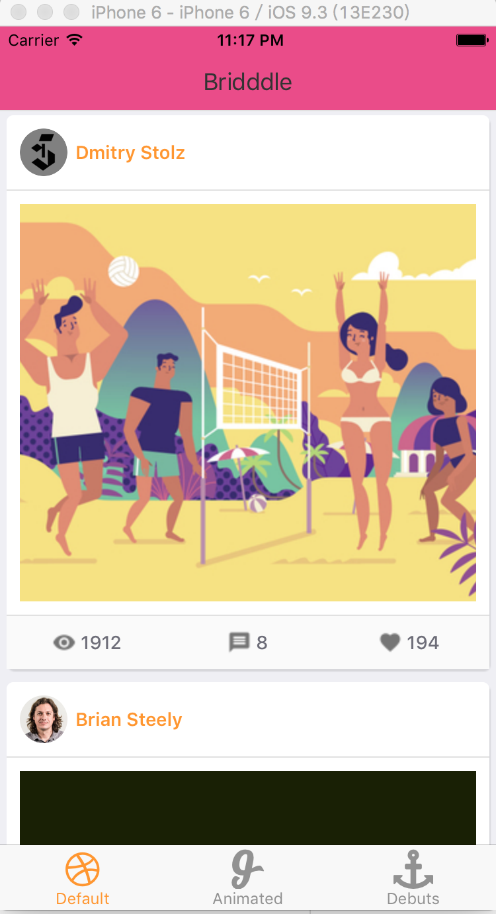
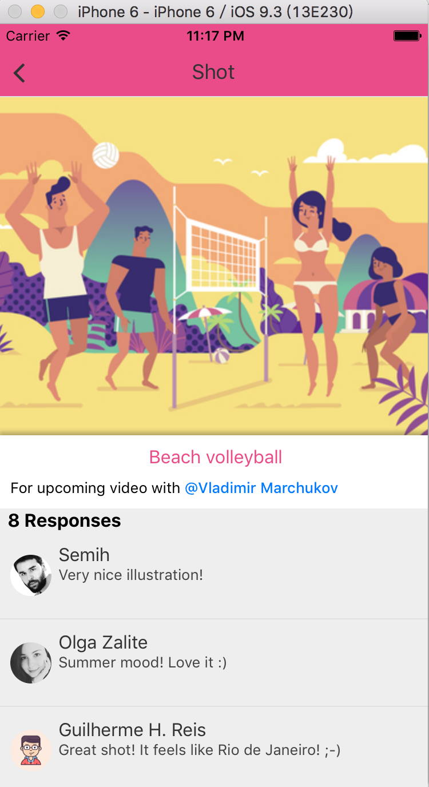
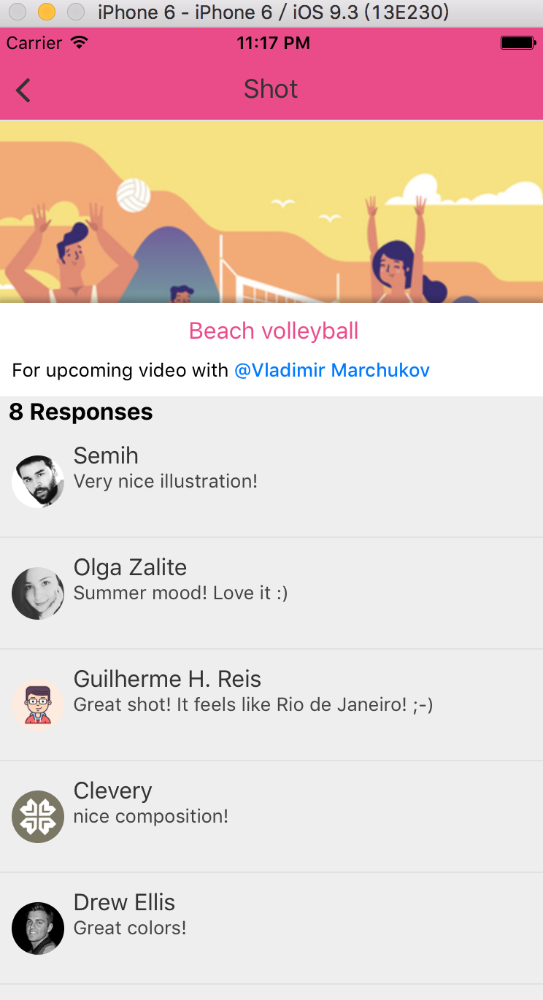

# Dribbble-React-Native

A [Dribbble](http://dribbble.com) app build with [React Native](https://github.com/facebook/react-native).

# Dribbble app screenshot

# How to run it locally

- Clone this repo `git clone https://github.com/LeiZong/Dribbble-React-Native.git`
- `cd Dribbble-React-Native`
- run `npm install`
- Open `Bridddle.xcodeproj` in `XCode`
- Press `cmd+r` to build it

# Plugins used:
- [HTML parser](https://github.com/jsdf/react-native-htmlview)
- [React native Parallax view](https://github.com/lelandrichardson/react-native-parallax-view)
- [React native vector icons](https://github.com/oblador/react-native-vector-icons)
- [Gifted ListView](https://github.com/FaridSafi/react-native-gifted-listview)
- [Customizable navbar](https://github.com/react-native-community/react-native-navbar)
- [TabNavigator](https://github.com/exponentjs/react-native-tab-navigator)